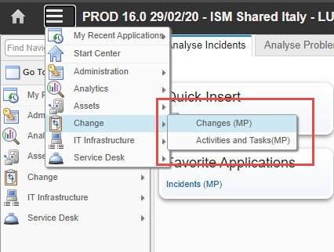
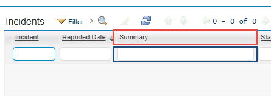
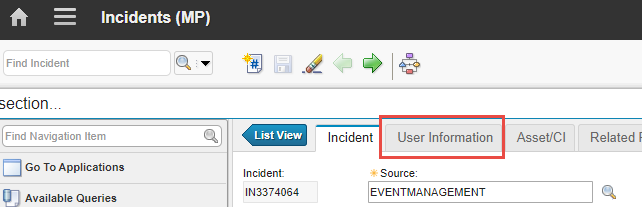
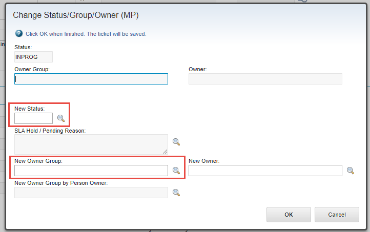

[](https://lbesson.mit-license.org/)
[](https://GitHub.com/LukeSavefrogs/maximo-gui-connector/tags/) 
[](https://pypi.python.org/pypi/maximo-gui-connector/)

# Maximo GUI Connector for Python
A small package that uses Selenium to automate the most basic operations you could do on IBM Maximo Asset Management

## Installation
1. Install the **package** by typing  `pip install maximo-gui-connector`
2. Download the **chromedriver** (see [this note](#IMPORTANT)) matching your browser version and put it into **PATH**

You can `import` the package into your script and use it like this: 
```python
import maximo_gui_connector as MGC

YOUR_USERNAME = ""
YOUR_PASSWORD = ""
YOUR_GROUP = ""

if __name__ == "__main__":
	try:
		maximo = MGC.MaximoAutomation({ "debug": False, "headless": False })
		maximo.login(YOUR_USERNAME, YOUR_PASSWORD)

		maximo.goto_section("changes")
		maximo.setFilters({ "status": "!=REVIEW", "owner group": YOUR_GROUP })

		data = maximo.getAllRecordsFromTable()
		print(data)

		maximo.logout()

	except Exception as e:
		print(e)

	finally:
		print()
		input("Press any key to stop the script and close chrome")

		"""
		So that if the error occurs before the `maximo` object is initialized, 
		`maximo.close()` doesn't throw a `NameError` exception
		"""
		try:
			maximo.close()
		except NameError as e:
			pass
```

## (In)complete Reference
This section is still work in progress, so some properties/methods could miss.
<table>
	<thead>
		<tr>
			<th>Name</th>
			<th>Description</th>
		</tr>
	</thead>
	<tbody>
		<tr>
			<td><code>MaximoAutomation(CONFIG)</code></td>
			<td>
				Instantiates the Maximo object. Takes a dictionary as an argument. Possible configuration:
				<br>
				<br>
				<table>
					<thead>
						<tr>
							<th>Name</th>
							<th>Description</th>
						</tr>
					</thead>
					<tbody>
						<tr>
							<td><code>debug</code></td>
							<td>
								If <code>True</code>, the logger will contain more information useful for debugging purposes. 
								<br>
								<br>
								Defaults to <code>False</code>
							</td>
						</tr>
						<tr>
							<td><code>headless</code></td>
							<td>
								If <code>True</code>, the browser will start hidden. 
								<br>
								<br>
								Defaults to <code>False</code>
							</td>
						</tr>
					</tbody>
				</table>
				Example:
				<br>
<pre>
<code>maximo = MGC.MaximoAutomation({ 
	"debug": False, 
	"headless": True 
})</code>
</pre>
			</td>
		</tr>
		<tr>
			<td><code>login(USERNAME, PASSWORD)</code></td>
			<td>Performs the login using the given credentials</td>
		</tr>
		<tr>
			<td><code>logout()</code></td>
			<td>Performs the logout</td>
		</tr>
		<tr>
			<td><code>goto_section(SECTION_NAME)</code></td>
			<td>
				Uses the <i>Goto</i> button to change section. It needs to be the text without the "(MP)" part...
				<br>
				<br>
				
			</td>
		</tr>
		<tr>
			<td><code>close()</code></td>
			<td>Closes the browser. Make sure to <strong>always</strong> call it after <code>logout()</code> to avoid running out of available sessions in Maximo after a while</td>
		</tr>
		<tr>
			<td><code>waitUntilReady()</code></td>
			<td>
				Pauses the script until Maximo has finished loading. 
				<br>
				<br>
				For example you can use it after changing section or clicking on an element to wait until Maximo has finished rendering or retrieving the data
			</td>
		</tr>
		<tr>
			<td><code>setFilters(FILTERS)</code></td>
			<td>
				Sets the filters of a table in the form of a dictionary where the <strong>key</strong> is the filter name (ex. Summary, <i>in red</i>) and the value is the filter value (ex. "Hostname not reachable", <i>in blue</i>)
				<br>
				<br>
				
				<br>
				To set multiple filters just add more key/value pairs. Ex:
				<br>
<pre>
<code>
setFilters({ 
	"Summary": "*Test*",
	"Priority": "1", 
	"Global Issue?": "Y" 
})
</code>
</pre>
			</td>
		</tr>
		<tr>
			<td><code>getBrowserInstance()</code></td>
			<td>
				Returns the <code>selenium.webdriver</code> instance of the browser so you can have more control or implement <i>custom actions</i> (like clicking on a particular element, inserting text somewhere and more...)
			</td>
		</tr>
		<tr>
			<td><code>goto_tab(TAB_NAME)</code></td>
			<td>
				Clicks on the specified tab when inside a record detail (ex. inside an Incident/Change, ecc...)
				<br> 
				<br> 
				
			</td>
		</tr>
		<tr>
			<td><code>getAllRecordsFromTable()</code></td>
			<td>
				Returns a dictionary containing all the details of all the records of a list table (ex. when inside <code>Changes open owned by my groups</code>).
			</td>
		</tr>
		<tr>
			<td><code>waitForInputEditable()</code></td>
			<td>
			</td>
		</tr>
		<tr>
			<td><code>setNamedInput(TARGETS)</code></td>
			<td>
				Takes a dictionary as argument and searches <code>input</code>s labelled by the string given as key; if presen, its value is set to the value of the corresponding pair in the dictionary
				<br>
				<br>
				
				<br>
				<br>
				To set the highlighted fields of the image you would have to call the method like this:
<pre>
<code>
setNamedInput({ 
	"New Status:": "NEW_STATUS",
	"New Owner Group:": "MY_GROUP",
})
</code>
</pre>
			</td>
		</tr>
		<tr>
			<!-- <td><code></code></td> -->
			<td colspan=2 align=center><i>To be continued...</i>
			</td>
		</tr>
	</tbody>
</table>

## Known Limitations
### By **default** it uses **Chrome**
**To use another browser**, or to set custom flags, you can create **your own webdriver instance** and pass it to _MaximoAutomation_ to use it. For example: 
```python
from selenium.webdriver import Firefox
from selenium.webdriver.firefox.options import Options

import maximo_gui_connector as MGC

opts = Options()
opts.set_headless()

assert opts.headless  # Operating in headless mode

my_webdriver_instance = webdriver.Firefox(options=opts)

maximo = MGC.MaximoAutomation({ "driver": my_webdriver_instance })
```

This method, however, introduces a **new problem**:

#### The Webdriver **MUST be** in the **PATH** when using custom Webdriver
To prevent having to download manually the right Webdriver the first time and every time the browser update, you can make use of the [**webdriver-manager**](https://pypi.org/project/webdriver-manager/) package.

What it does is essentially keep a cached version of the Webdriver check every time if the Webdriver version is the same as the installed browser. If not it downloads it.

To use it:

```python
from selenium import webdriver

# Webdriver Manager
from webdriver_manager.firefox import GeckoDriverManager

import maximo_gui_connector as MGC

# If not 'installed' it will download an updated version of the driver
my_webdriver_instance = webdriver.Firefox(executable_path=GeckoDriverManager().install())

maximo = MGC.MaximoAutomation({ "driver": my_webdriver_instance })
```
